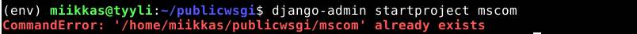
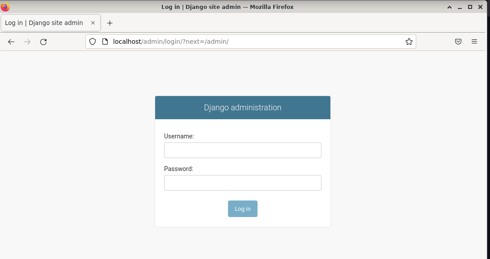

# h11 Task

## Kone 
- Lenovo Y510P läppäri
- Suoritin: Intel(R) Core(TM) i7-4700MQ CPU @ 2.40GHz
- 8 GB RAM
- Windows 10, versio: 22H2

Aloitin tehtävän tekemisen ~00:20

## a) Django tuotantoasennus

Aloitin käynnistämällä apache:n ``$ sudo systemctl start apache2``, jonka jälkeen tarkistin, että serveri vastaa komenentokehotteesta ``$ curl localhost``.

Serveri vastasi aikaisemmin luomallani vastauksella, eli apache toimii.

Seuraavaksi tein kansiot sekä tiedostopolun samalla django projektia varten.

Tämän jälkeen loin ``mscom.conf`` tiedoston apachen palvelinta varten. 

    $ sudoedit /etc/apache2/sites-available/mscom.conf

Lisäsin tiedostoon tiedostopolun ``mscom.conf`` tiedostoa varten. Kävin kopioimassa tiedostopolut komentokehotteesta, jotta ne tulevat varmasti oikein. Menin kotihakemistoon ``$ cd``, josta operoin ``cd``:n ja ``tab``:n avulla oikeaan tiedostopolkuun ja lopussa ``pwd``:n avulla otin tiedostopolun ja kopioin sen.

Liitin tiedostopolut ``mscom.conf`` tiedostoon``

Seuraavaksi otan ``mscom.conf`` tiedoston käyttöön apachen palvelimelle.
- Ensin katson mitä apachen etusivu nyt näyttää.

- Apachen palvelin näyttää ``000-default.conf`` sivua, joten poistan sen käytöstä. ``$ sudo a2dissite 000-default.conf``
- Otan ``mscom.conf`` sivun käyttöön ``$ sudo a2ensite mscom.conf``
- Katson toimiiko uusi konfiguraatio ``$ /sbin/apache2ctl configtest``.

- Testi vastasi ``AH00558`` ja Syntax OK eli tiedostossa pitäisi olla kaikki ok.
- Pävitin Apachen palvelimen ``$ sudo systemctl restart apache2``
- Testaan tuliko uusi sivu näkyviin apachen etusivulle ``$ curl localhost/static/``

static/ sivut vastaavat index.html tiedostoon luomallani tekstillä eli static/ sivut toimivat.

### Uusi Django projekti.

- Aktivoin uuden virtuualiympäristön(env) ``publicwsgi`` kansioon`. 
    
    $ cd
    $ cd publicswgi
    $ virtualenv -p python3 --system-site-packages env

- Aktivoin virtuaaliympäristön(env)

    $ source env/bin/activate

- Asensin djangon uuteen virtuaali ympäristöön:

    $ 
    $ which pip
    /home/miikkas/publicwsgi/env/bin/pip
    
- ``requirements.txt`` kansioon paketin nimi eli ``django`` varmuuden vuoksi, ettei tule kirjoitusvirheitä.
    $ micro requirements.txt
    $ cat requirements.txt
    django
    $ pip install -r requirements.txt
    
- Django version tarkastus

    $ django-admin --version
    4.1.7

- Uusi projekti 

    $ django-admin startproject mscom
    
- Sain errorin:

Ratkaisin poistamalla kansion mscom 
- Ensin pois virtuaaliympäristöstä

    $ deactivate

- Poistin kansion sekä sen sisällöt eli myös static kansion ja index.html tiedoston, joka oli static kansion sisällä. Lisäämällä komentoon ``-r`` poistuu kansio sisältöineen.

    $ rm -r mscom/
   
- Aktivoin virtuaaliympäristön uudestaan   
   
    $ source env/bin/activate

- Loin django projektin 

    $ django-admin startproject mscom

- Poistuin virtuaaliympäristöstä ja kävin tekemässä uudestaan ``static/`` kansion sekä kansion sisälle ``index.html`` tiedoston, johon kirjoitin simppelin "Uusi static sivu"

- Takaisin virtuaaliympäristöön

    $ source env/bin/activate
    
- Muokkaamaan mscom.conf tiedostoa

    $ sudoedit /etc/apache2/sites-available/mscom.conf
    

Tiedoston mallin kopioin suoraan Tero Karviselta, Deploy Django 4 - Production Install, Luettavissa: https://terokarvinen.com/2022/deploy-django/#connect-python-to-apache-using-mod_wsgi

- Vaihdoin tiedostopolut omiini. 

- Asensin Apachen WSGI moduulin.

    $ sudo apt-get -y install libapache2-mod-wsgi-py3
    
- Tarkastin syntaksin.
    

- Syntaksi näyttäisi olevan jälleen kunnossa, käynnistetään apache uudelleen.

    $ sudo systemctl restart apache2

- Testataan mitä sivu vastaa, jonka jälkeen katsotaan, mitä serveriä sivu käyttää.

    $ curl -s localhost|grep title
    $ curl -sI localhost|grep Server

Vastaukset:

Homma pelaa, oikea title tuli näkyviin ja serverikin näyttäisi olevan Apache.

- Tsekataan vielä selaimella.

Toimii! Django projekti näkyy nyt apachen pyörittämällä sivulla.

### Napataan DEGUB pois päältä.

    $ cd
    $ cd publicwsgi/mscom/
    $ micro mscom/settings.py 

    $ touch mscom/wsgi.py
    

DEBUG sivu on nyt pois päältä 

http://localhost/admin/ toimii edelleen, jotta pääsen hallitsemaan projektia.

### Lisätään tyyliä.

    $ cd
    $ cd publicwsgi/mscom/
    $ micro mscom/settings.py

- Lisäsin tiedostoon:
    
    import os
    STATIC_ROOT = os.path.join(BASE_DIR, 'static/')
    
Syötin ``$ ./manage.py collectstatic``, joka vastasi seuraavalla errorilla.

Rivien lopussa seuraava rivi kertoo syyn

    "FILE ".......", line 13, in <module>
      STATIC_ROOT = os.path.join(BASE_DIR, 'static/')
    NameError: name 'BASE_DIR' is not defined. 

Eli ``BASE_DIR`` ei ole määritelty. Kävin tarkistamassa kansion 
    
    $ cd publicwsgi/mscom/
    $ ls

Huomasin, että static kansiossa ei ole perässä ``/`` merkkiä. Kävin muokkaamassa uudestaan ``mscom/settings.py`` tiedostoa ja poistin ``/`` merkin eli

    STATIC_ROOT = os.path.join(BASE_DIR, 'static')

Tämän jälkeen uudestaan 

    $ ./manage.py collectstatic

Nyt näyttää oikealta, pävitellään django projekti komennolla ``$ touch mscom/wsgi.py`` ja katsotaan, miltä admin sivut nyt näyttää.

Nyt sivut näyttävät paremmalta.

a) kohta valmis ~2:50 eli hieman alta 3h vierähti. 
